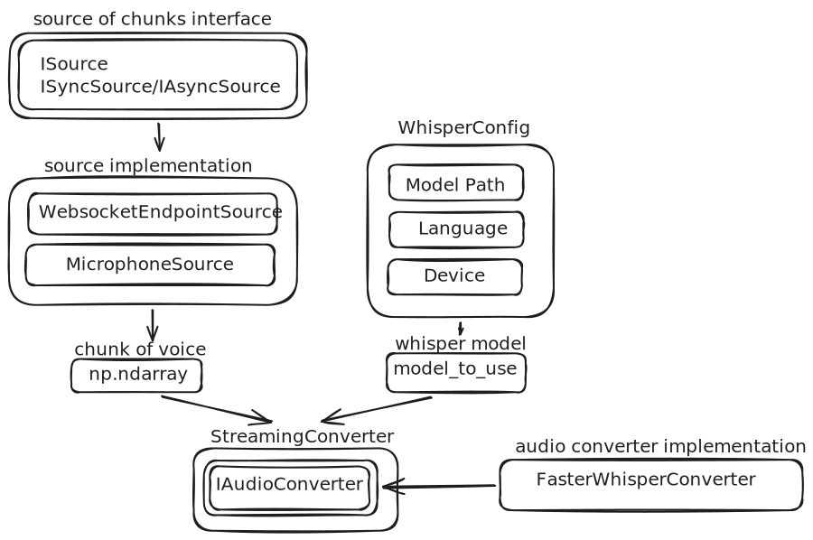

# Real-Time Speech-to-Text Streaming Service (Faster-Whisper)

A real-time audio transcription engine built on top of **faster-whisper**, designed around a
clean **ports-and-adapters (hexagonal) architecture**. It supports two interchangeable audio
sources — a local **microphone** and a **WebSocket** stream — feeding into a single streaming
transcription pipeline that emits incrementally-stabilizing live text.

> ⚠️ **GPU / CUDA REQUIRED.** This project **must be run on an NVIDIA GPU with CUDA**.
> Running on CPU is technically possible, but the streaming pipeline re-transcribes a growing
> audio buffer on **every incoming chunk**, so CPU inference is far too slow to keep up with
> real-time audio and the "live" transcript will constantly lag behind or stutter. See
> [GPU requirements](#gpu-requirements--cuda) below.

---

## Table of Contents

- [Architecture](#architecture)
- [Project Layout](#project-layout)
- [How the Streaming Algorithm Works](#how-the-streaming-algorithm-works)
- [Installation](#installation)
- [GPU Requirements / CUDA](#gpu-requirements--cuda)
- [Configuration (`WhisperConfig`)](#configuration-whisperconfig)
- [Microphone Endpoint](#microphone-endpoint)
- [WebSocket Endpoint](#websocket-endpoint)
- [Running the Tests](#running-the-tests)

---

## Architecture

The codebase follows a **ports-and-adapters** style so that the transcription core never
depends on *how* audio arrives, or *which* speech-to-text engine is used:



**Key components:**

| Component | Role |
|---|---|
| `interfaces/ISource.py` | Defines `ISource` (lifecycle: `open` / `is_active` / `close`), and two flavors: `ISyncSource` (blocking `get_chunk`) and `IAsyncSource` (async `get_chunk`). |
| `interfaces/IAudioConverter.py` | Defines the contract for any speech-to-text backend: `_load_model` and `convert_audio_to_text`. |
| `source/audio_sources/MicrophoneSource.py` | Sync adapter — captures raw audio blocks from the system microphone via `sounddevice`, buffered through a thread-safe `queue.Queue`. |
| `source/audio_sources/WebSocketSource.py` | Async adapter — wraps a Starlette/FastAPI `WebSocket` and turns incoming binary frames into `float32` numpy arrays. |
| `source/WhisperConfig.py` | Immutable config object (`model_path`, `language`, `device`) — identifies "which model/settings" a converter should use. |
| `source/FasterWhisperConverter.py` | Concrete `IAudioConverter` — lazily loads and caches a `faster_whisper.WhisperModel`, transcribes audio (numpy array or file path) into Whisper segments. |
| `source/StreamingConverter.py` | The core streaming orchestrator. Accumulates audio, re-transcribes the buffer, and uses a **rolling common-prefix comparison** between consecutive transcriptions to "confirm" stable words while keeping the tail "live"/mutable. Trims/flushes buffers to bound memory and latency. |

Because both audio sources implement the same `ISource` contract, and the converter implements
`IAudioConverter`, you can swap the microphone for the WebSocket source (or swap
`FasterWhisperConverter` for another engine) without touching `StreamingConverter`.

---

## Project Layout

```
.
├── interfaces/
│   ├── ISource.py            # ISource / ISyncSource / IAsyncSource
│   └── IAudioConverter.py    # IAudioConverter port
├── source/
│   ├── WhisperConfig.py      # model/device/language config dataclass
│   ├── FasterWhisperConverter.py   # faster-whisper adapter (CUDA/CPU)
│   ├── StreamingConverter.py       # buffering + live-stabilization logic
│   └── audio_sources/
│       ├── MicrophoneSource.py     # sync mic capture (sounddevice)
│       └── WebSocketSource.py      # async WebSocket capture (FastAPI/Starlette)
├── tests/                    # pytest unit/integration tests + mocks
├── usage_example.py          # end-to-end microphone → live transcript demo
├── requirements.txt
├── pytest.ini
└── conftest.py
```

---

## How the Streaming Algorithm Works

`StreamingConverter.process_chunk()` is called once per incoming audio chunk and:

1. **Appends** the new chunk to a running `float32` audio buffer.
2. **Re-transcribes** the *entire current buffer* with the Whisper model (this is why CUDA
   matters — every chunk re-runs inference over a growing window, not just the new bytes).
3. **Compares** the new word list against the previous call's word list, word-by-word, and
   "confirms" the longest common prefix — those words are considered stable and appended to the
   permanent `_result`.
4. **Builds the live result** = confirmed text + the still-unconfirmed tail of the current
   transcription (so the UI/consumer can show fast-updating "live" text plus a stable prefix).
5. **Cleans up**: trims transcript history to the last 2 results, and once the audio buffer
   exceeds 30s, flushes it down to a 2s overlap window (keeping a bit of context) and resets the
   confirmation state — bounding both memory and per-call latency indefinitely.

This is the same general idea used by "local agreement" streaming-Whisper implementations:
trade a little bit of latency for a transcript that doesn't visibly flicker/rewrite itself.

---

## Installation

```bash
python -m venv .venv
# Windows: .venv\Scripts\activate
# Linux/Mac: source .venv/bin/activate

pip install -r requirements.txt
```

The pinned `requirements.txt` already includes CUDA 12.x runtime wheels
(`nvidia-cublas-cu12`, `nvidia-cudnn-cu12`, `nvidia-cuda-runtime-cu12`) needed by
`ctranslate2`/`faster-whisper` for GPU inference — no separate CUDA toolkit install is required
on Linux. On **Windows**, DLL auto-discovery can be flaky; `usage_example.py` includes a
`preload_nvidia_dlls()` helper that explicitly adds the pip-installed NVIDIA package
`bin/lib` folders to `os.add_dll_directory()` and preloads the DLLs before `faster_whisper` is
imported. Keep/reuse this helper (or an equivalent) in any Windows entry point you write.

You also need a local **faster-whisper / CTranslate2 model** on disk (e.g. a converted
`large-v3` model directory) and point `WhisperConfig.model_path` at it.

---

## GPU Requirements / CUDA

**This project must be run with `device="cuda"` in `WhisperConfig`.** `StreamingConverter`
re-transcribes the full rolling buffer on every single chunk. On CPU this repeated,
whole-buffer inference cannot keep pace with real-time audio — latency grows unbounded and the
"live" transcript falls further and further behind (or the app effectively freezes on longer
utterances). `compute_type` is already set automatically by `FasterWhisperConverter`
(`float16` on GPU, `int8` on CPU as a fallback only), but CPU should be treated as a
debugging/offline mode, **not** for real-time streaming use.

### Recommended GPUs

Any modern NVIDIA GPU with CUDA support and enough VRAM works; `large-v3` in `float16` needs
roughly **~10 GB VRAM** (smaller Whisper models need much less). Guidance:

| Tier | GPUs | Notes |
|---|---|---|
| **Best (data center)** | NVIDIA H100, A100 (40/80GB), L40S | Highest throughput, ideal for multiple concurrent streams/WebSocket clients. |
| **Great (workstation/consumer, high-end)** | RTX 4090, RTX 4080 (16GB), RTX 3090 / 3090 Ti (24GB), RTX A6000 | Comfortably runs `large-v3` in float16 with headroom for concurrent sessions. |
| **Good (consumer, mid-range)** | RTX 4070 Ti Super (16GB), RTX 4070 Ti / 4070 (12GB), RTX 3080 (10–12GB), RTX 3080 Ti | Sufficient for `large-v3`; use a smaller model (`medium`/`small`) if VRAM is tight or multiple streams are needed. |
| **Cloud / inference-optimized** | NVIDIA T4 (16GB), L4 (24GB), A10 (24GB) | Common on AWS/GCP/Azure; L4/A10 give solid float16 throughput at lower cost than A100/H100. |
| **Minimum viable** | Any CUDA GPU with ≥ 6–8 GB VRAM (e.g. RTX 3060 12GB, RTX 2060 Super) | Use `medium` or smaller Whisper models for real-time performance; `large-v3` may be too slow/tight on VRAM for smooth streaming. |

If VRAM is limited, drop to a smaller Whisper checkpoint (`medium`, `small`, `distil-large-v3`,
etc.) rather than falling back to CPU — that preserves real-time performance while reducing
memory use.

---

## Configuration (`WhisperConfig`)

```python
from pathlib import Path
from source.WhisperConfig import WhisperConfig

model_to_use = WhisperConfig(
    model_path=Path("whisper_models/large-v3"),  # local faster-whisper/CTranslate2 model dir
    language="en",                                 # target language
    device="cuda",                                 # "cuda" required for real-time use
)
```

`FasterWhisperConverter` compares `WhisperConfig` instances (they're frozen dataclasses, so
equality is by value) to decide whether to reload the model — passing the same config across
calls reuses the cached `WhisperModel`.

---

## Microphone Endpoint

The microphone path uses `MicrophoneSource` (a **synchronous**, blocking `ISyncSource`) feeding
a `StreamingConverter` in a simple loop. This is exactly what `usage_example.py` demonstrates:

```python
from pathlib import Path
import numpy as np

from source.FasterWhisperConverter import FasterWhisperConverter
from source.StreamingConverter import StreamingConverter
from source.audio_sources.MicrophoneSource import MicrophoneSource
from source.WhisperConfig import WhisperConfig

MODEL_PATH = Path(__file__).parent / "whisper_models/large-v3"

def main() -> None:
    model_to_use = WhisperConfig(model_path=MODEL_PATH, language="en", device="cuda")
    converter = FasterWhisperConverter()
    streaming_converter = StreamingConverter(converter)
    source = MicrophoneSource(block_size=24000)  # ~1.5s of audio @ 16kHz per block

    # Warm up the model once up-front so the first real chunk isn't slow.
    warmup_chunk = np.zeros(16000, dtype=np.float32)
    converter.convert_audio_to_text(warmup_chunk, model_to_use)

    source.open()
    try:
        while source.is_active():
            audio_chunk = source.get_chunk()
            live_result = streaming_converter.process_chunk(audio_chunk, model_to_use)
            print(live_result)
    except KeyboardInterrupt:
        pass
    finally:
        source.close()

if __name__ == "__main__":
    main()
```

Run it directly:

```bash
python usage_example.py
```

`MicrophoneSource(sample_rate=16000, channels=1, block_size=1024)` captures audio via
`sounddevice.InputStream`, pushing each captured block onto an internal `queue.Queue`;
`get_chunk()` blocks until a block is available. `block_size` controls how much audio (in
samples) arrives per chunk — larger blocks mean fewer, chunkier transcription calls; smaller
blocks mean lower latency but more frequent GPU inference calls.

---

## WebSocket Endpoint

The WebSocket path uses `WebsocketEndpointSource` (an **asynchronous** `IAsyncSource`) that
wraps a FastAPI/Starlette `WebSocket` connection, converting incoming binary frames
(raw `float32` PCM bytes) into numpy arrays via `np.frombuffer`.

The repository doesn't ship a standalone FastAPI app file — the wiring pattern is shown in
`tests/test_on_websocket.py` — so a minimal real server (`server.py`) looks like this:

```python
from fastapi import FastAPI, WebSocket
from pathlib import Path

from source.FasterWhisperConverter import FasterWhisperConverter
from source.StreamingConverter import StreamingConverter
from source.audio_sources.WebSocketSource import WebsocketEndpointSource
from source.WhisperConfig import WhisperConfig

app = FastAPI()
MODEL_PATH = Path("whisper_models/large-v3")
model_to_use = WhisperConfig(model_path=MODEL_PATH, language="en", device="cuda")
converter = FasterWhisperConverter()

@app.websocket("/ws")
async def ws_endpoint(websocket: WebSocket):
    await websocket.accept()

    source = WebsocketEndpointSource(websocket)
    streaming_converter = StreamingConverter(converter)
    source.open()

    try:
        while source.is_active():
            chunk = await source.get_chunk()
            if chunk is None:  # client disconnected
                break
            live_result = await run_in_threadpool_or_await(
                streaming_converter.process_chunk, chunk, model_to_use
            )
            await websocket.send_text(live_result)
    finally:
        source.close()
```

> Note: `StreamingConverter.process_chunk` and `FasterWhisperConverter.convert_audio_to_text`
> are **synchronous/blocking** GPU calls. In a real async server, run them off the event loop
> (e.g. `await starlette.concurrency.run_in_threadpool(streaming_converter.process_chunk, ...)`)
> so one slow transcription doesn't stall other WebSocket connections.

Run it with an ASGI server:

```bash
pip install uvicorn
uvicorn server:app --host 0.0.0.0 --port 8000
```

**Client protocol:** connect to `ws://<host>:8000/ws` and send raw little-endian `float32` PCM
audio bytes, mono, 16kHz, as binary WebSocket frames — mirroring what `MicrophoneSource`
produces internally (`np.ndarray.tobytes()` on the sending side). The server replies with the
current live transcript as a text frame after each processed chunk. The connection closes
automatically when the client disconnects (`WebSocketDisconnect` → `get_chunk()` returns
`None`).

---

## Running the Tests

```bash
pytest
```

`pytest.ini` sets `asyncio_mode = auto`, so `async def test_...` functions run without extra
decorators. Tests cover:

- `tests/test_on_microphone.py` — interface contract checks (`ISource`/`ISyncSource`/`IAsyncSource`).
- `tests/test_on_websocket.py` — `WebsocketEndpointSource` behavior via a mock WebSocket and a real FastAPI `TestClient`.
- `tests/test_on_converter.py` — `FasterWhisperConverter` model loading/transcription against a mock audio sample (`tests/moks/hello_audio_mok.ogg`) — **requires a real local model and, ideally, a CUDA GPU** to run in reasonable time.
- `tests/test_on_process_chunk.py` / `tests/test_on_streaming_convert_.py` — `StreamingConverter` buffering and prefix-confirmation logic using fully mocked/fake converters (no GPU required).

Note that `tests/moks/ModelsEnum.py` currently assumes that large-v3 version is installed
